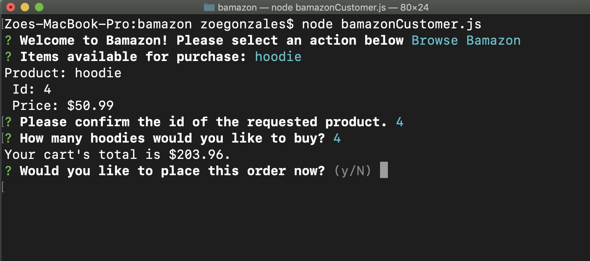
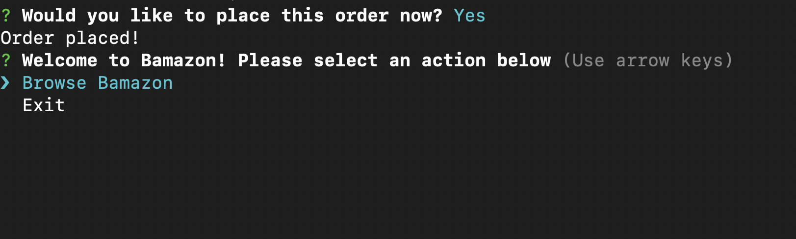
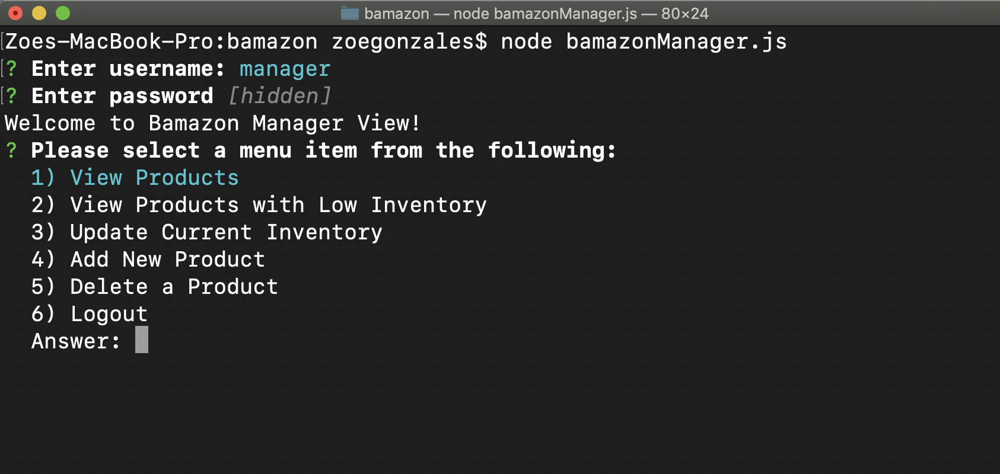
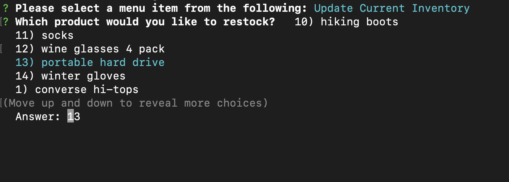
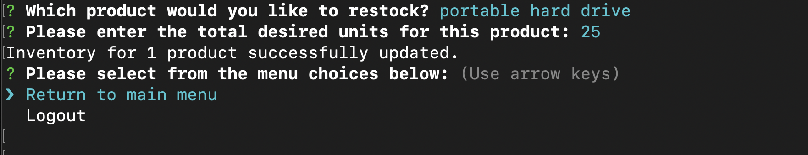
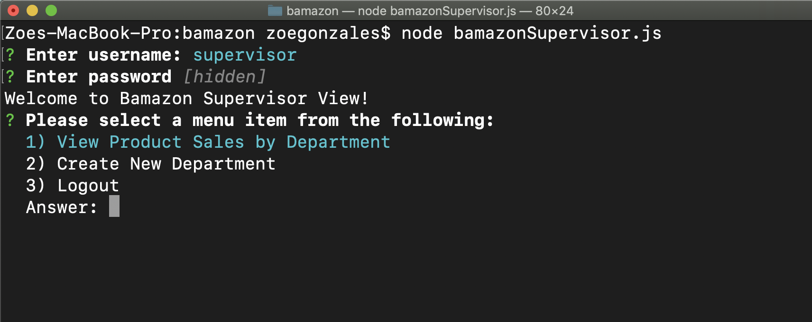
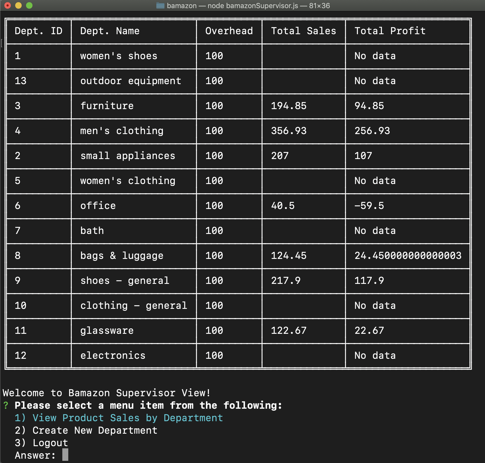

# bamazon

## Summary
Bamazon is a Node.js CLI app that functions like an online store. Three views - customer, manager, and supervisor - allow functionality that mimics shopping in a store, viewing and updating inventory, and viewing total sales by department. All bamazon data is stored in a MySQL database.

## npm modules used
inquirer, mysql, table

## Installation
* Clone this repository to the directory of your choice
* Run ` npm install `
* Run the SQL in ` schema.sql ` in MySQL Workbench; repeat for ` seeds.sql `  
* Run one of the following: ` node bamazonCustomer `, ` node bamazonManager `, ` node bamazonSupervisor `
* **Manager View**
    * username: ` manager ` 
    * password: ` hello `
* **Supervisor View**
    * username: ` supervisor ` 
    * password: ` hola `
* Follow the prompts related to the selected view

## Customer view

With this view, users can: 
* Search for current products for sale and purchase multiple units of a product

Bamazon browse view

Selecting a product for purchase

Product purchased

**Demo:** https://drive.google.com/file/d/1KhEeAXQXEvmXOEZK265q2SPT_O9WfqDJ/view?usp=sharing

## Manager View

With this view, users can: 
* View all inventory currently in stock
* View all products with low inventory (less than 5 units in stock)
* Restock inventory for any existing products
* Create new products, specifying name, department, price, and quantity
* Delete existing products in the inventory

Manager main menu

Updating inventory for selected product

Inventory updated

**Demo:** https://drive.google.com/file/d/1sXDVgRaF7lm2l9tFyDU2ajeHfe820B6i/view?usp=sharing

## Supervisor View

With this view, users can: 
* View total sales by department (based on stock purchased in customer view)
* Create a new department, specifying name and overhead costs

Supervisor main menu

Total Sales by department

**Demo:** https://drive.google.com/file/d/1Wo2SxJ4ebBQTI1Gw9FEbzWdEyQ5rVlZH/view?usp=sharing