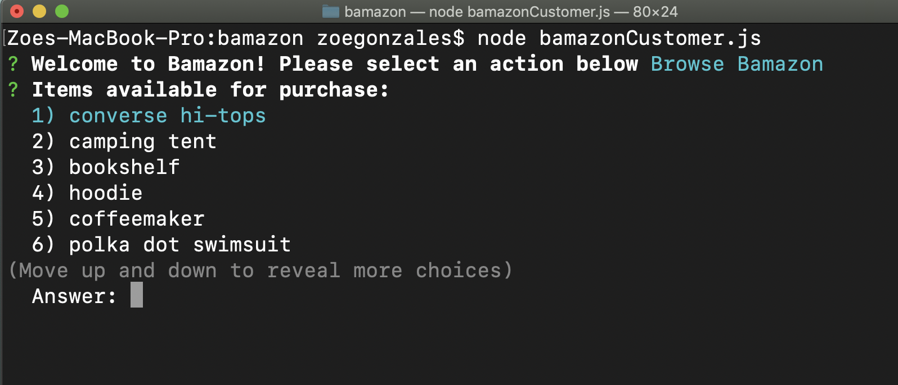

# bamazon

## Summary
Bamazon is a Node.js CLI app that functions like an online store. Three views: customer, manager, and supervisor, allow functionality that mimics shopping in the store, viewing and updating inventory, and viewing department total sales.

## npm modules used
inquirer, mysql, table

## Installation
* Clone this repository to the directory of your choice
* Run ` npm i `
* Run one of the following: ` bamazonCustomer `, ` bamazonManager `, ` bamazonSupervisor `
* ` bamazonManager ` username is ` manager ` and password is ` hello `
* ` bamazonSupervisor ` username is ` supervisor ` and password is ` hola `
* Follow the prompts related to the selected view.

## Customer view
Bamazon browse view

Selecting a product for purchase

Product purchased

Demo: coming soon

## Manager View
Manager main menu

Updating inventory for selected product

Inventory updated

Demo: coming soon

## Supervisor View
Supervisor main menu

Total Sales by department

Demo: coming soon